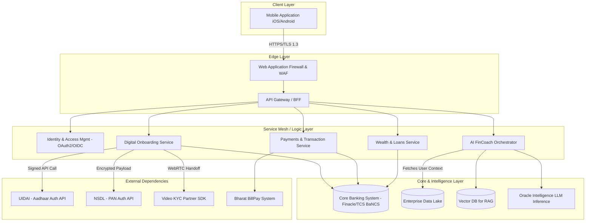

# Technical Requirements Document (TRD) & Architecture Spec: Federal Bank Digital Application & AI FinCoach

## 1. System Architecture
The application follows a secure, microservices-based, mobile-first architecture tailored for Tier-1 banking environments. It separates the presentation tier from the orchestration layer and core banking backend.

### High-Level Architecture Diagram


## 2. API Integration Strategy (Digital Onboarding)

Strict security and fault-tolerance patterns govern integrations with regulatory bodies.

### 2.1 PAN Validation (NSDL API)
- **Protocol:** Synchronous RESTful POST request.
- **Security:** Request payload (PAN, DOB) is encrypted symmetrically (e.g., AES-256-GCM) before transit. Mutual TLS (mTLS) is enforced between the API Gateway and NSDL.
- **Fallback:** In offline/timeout scenarios, UI displays a graceful message ("Verification delayed") and queues the request for background polling.
- **Data Handling:** PAN response data is parsed for name matching and immediately passed to the core system without logging the raw response in operational logs.

### 2.2 Aadhaar Validation (UIDAI API)
- **Protocol:** Two-step asynchronous flow (Generate OTP -> Validate OTP).
- **Security:** Requires digital signing of XML payloads using Federal Bank's registered sub-AUA certificate.
- **State Management:** The "Generate OTP" request returns a Transaction ID (`txnId`). The mobile client holds this state temporarily. The "Validate OTP" call transmits the `txnId` + User-entered OTP.
- **PII Storage:** Aadhaar numbers are tokenized in memory. The raw 12-digit number is never stored persistently on the device or application databases (Vault storage only).

### 2.3 Video KYC SDK Integration
- **Implementation:** React Native/Flutter embedded WebView or native WebRTC SDK.
- **Bandwidth Handling:** Adaptive bitrate streaming to handle low-network zones.
- **Handoff:** The Onboarding Service generates a unique, time-bound secure token. The app initializes the SDK with this token, linking the call to the pending account reference number.

## 3. AI Architecture: FinCoach (Credit Card Recommendation)

The AI FinCoach acts as an intelligent intermediary between the user's natural language and the bank's deterministic product rules.

### 3.1 Context Gathering Pipeline
1. **Trigger:** User initiates the FinCoach for "Credit Cards."
2. **Context Aggregation:** The AI Service queries the Enterprise Data Lake for the user's recent aggregations (Average Monthly Balance, Top 3 spend categories over 6 months).
3. **Prompt Formulation:** The system constructs a hidden system prompt injecting this deterministic financial profile alongside the user's live chat message.

### 3.2 RAG (Retrieval-Augmented Generation) Implementation
- **Vector DB:** Contains embeddings of all Federal Bank Credit Card product specifications, eligibility criteria, and fee structures.
- **Matching:** The LLM generates a search query based on the aggregated context + user request (e.g., "High travel spend, desires lounge access"). The Vector DB returns the top 2 matching cards.
- **Synthesis:** The LLM constructs a natural language response ("Based on your flight expenditures, I recommend the Celesta Card...") and outputs a structured JSON payload identifying the specific `CardID`.

### 3.3 UI Rendering
- The mobile app parses the JSON payload to render a rich, interactive "Bento-Box" card displaying the recommended Federal Bank credit card, allowing a 1-click "Apply Now" action.

## 4. Data Models & State Management

### 4.1 Client-Side State Management (Mobile)
- **Pattern:** Centralized state tree (e.g., Redux Toolkit or Zustand).
- **Transient State:** OTPs, plain-text PANs, and unverified form fields exist only in volatile React/Flutter state. They are cleared upon `onUnmount` or app backgrounding.
- **Persistent State:** JWT Auth Tokens, minimal profile metadata (Name, Masked Account Number), and user preferences (Theme mode).

### 4.2 Core Data Models (Backend)

**UserModel:**
```json
{
  "customerId": "UUID",
  "status": "ACTIVE | PENDING_KYC | LOCKED",
  "auth": {
    "mPinHash": "String",
    "biometricEnabled": "Boolean"
  },
  "demographics": {
    "name": "String",
    "maskedPan": "XXXXX1234X",
    "riskProfile": "Aggressive | Moderate | Conservative"
  }
}
```

**FinCoachSessionModel:**
```json
{
  "sessionId": "UUID",
  "customerId": "UUID",
  "context": {
    "topic": "Credit_Cards",
    "aggregatedSpend": 250000,
    "primaryCategory": "Travel"
  },
  "interactionLog": [
    {"role": "user", "content": "I need a card for travel."},
    {"role": "agent", "content": "I recommend Celesta...", "recommendedProductId": "CH-102"}
  ],
  "startedAt": "Timestamp",
  "status": "CONCLUDED"
}
```

### 4.3 Revenue Engine State Logic (Sprint 5)
#### 4.3.1 Investment Ledger (FD/Portfolio)
- **Mechanism:** Double-entry simulation.
- **Trigger:** `handleBookFD` in `App.tsx`.
- **Logic:** `CurrentAccountBalance -= Principal`; `InvestmentAmount += Principal`.
- **Valuation:** Interest accrued is calculated client-side for UX, but maturity instructions are logged in the simulated ledger.

#### 4.3.2 Lending Ledger (Loans)
- **Mechanism:** "Flash Credit" logic.
- **Trigger:** `handleLoanDisbursal` in `App.tsx`.
- **Logic:** `CurrentAccountBalance += LoanAmount`; `LiabilityAmount += LoanAmount`.
- **Compliance:** KFS (Key Fact Statement) download link verification is mandatory before the application state transitions to "ACCEPTED."

- **Refresh Mechanism:** Cross-component state updates (Payments -> Dashboard) are handled via lifted state in `App.tsx` ensuring the "Aggregate Balance" is a single source of truth across all modules.

### 4.5 Dynamic Theming Engine (Sprint 7)
- **Architecture:** `ThemeContext` + CSS Variables.
- **Switching:** A top-level wrapper injects theme-specific CSS variables based on the active state.
- **Consistency:** All color tokens follow a `*-themed` naming convention (e.g., `--federalblue-themed`) to allow hot-swapping backgrounds and accents while keeping structural layouts intact.

### 4.6 Niche Lending Logic (Gold Loan & LAS)
- **Valuation Logic:** `SanctionLimit = (CollateralValue * LTV) - Margin`.
- **Status Pipeline:** `SANCTIONED_DIGITALLY` -> `PENDING_PHYSICAL_APPRAISAL` -> `DISBURSED`.
- **Compliance:** LAS requires a digital signature on a lien-marking document simulate via a `ConsentCheckbox` log.

### 4.3 Security In-Memory
- Memory wiping routines are enforced post-KYC to ensure no garbage collection delays expose sensitive memory dumps. 
- API request/response structures are strictly typed using GraphQL or Protobufs to prevent over-fetching or prototype pollution.
